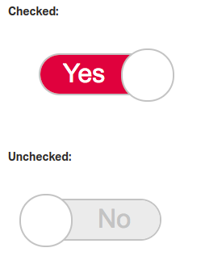

# holbertonschool-Fun-with-CSS

In this project, I will experiment and implement fun layout with HTML and CSS **ONLY**!

Yes, no JavaScript!

Let's have fun !

## Expected layouts

### Task 0

### Task 1

### Task 2

### Task 3

